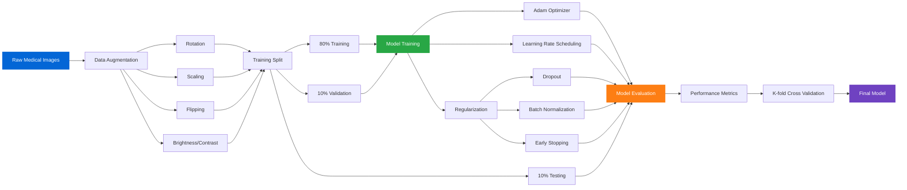

#  Brain Tumor MRI Detection

Our brain tumor detection module uses a fine-tuned **Xception architecture** to analyze MRI scans and identify tumor types with high precision.

#### 🎯 Detection Categories
- **Glioma Tumors** - Malignant tumors originating in glial cells
- **Meningioma Tumors** - Typically benign tumors from the meninges
- **Pituitary Tumors** - Hormone-affecting tumors in the pituitary gland
- **No Tumor** - Normal brain tissue classification

#### 🔧 Technical Specifications
- **Base Architecture:** Xception (ImageNet pretrained)
- **Input Resolution:** 299×299 pixels
- **Training Dataset:** Thousands of annotated MRI images
- **Classification Output:** 4 categories with confidence scores

#### 📋 Clinical Information
- **Glioma:** Represents 33% of all brain tumors, 80% of malignant cases
- **Meningioma:** Accounts for 37% of primary brain tumors
- **Pituitary:** Comprises 10-15% of all brain tumors

---

### Model Training Pipeline

---
